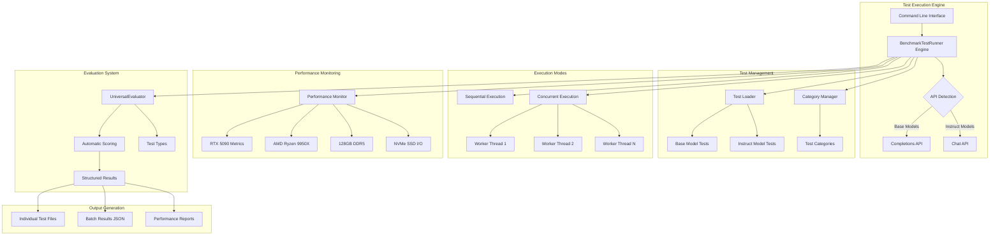

# LLM Benchmark Test Suite

A comprehensive, modular benchmarking framework for evaluating Large Language Model (LLM) performance across diverse reasoning tasks. Built specifically for high-performance AI engineering workstations with hardware-accelerated inference monitoring and concurrent test execution capabilities.

This framework provides standardized evaluation of reasoning capabilities including complex synthesis, mathematical reasoning, chain-of-thought analysis, and Linux system administration tasks. Designed to leverage dual GPU/CPU inference architectures for maximum testing efficiency and detailed performance analysis.

> **Hardware Optimization**: Optimized for RTX 5090 (32GB VRAM), AMD Ryzen 9950X (16-core), and 128GB DDR5 configurations with comprehensive hardware performance monitoring during test execution.

## Table of Contents

- [LLM Benchmark Test Suite](#llm-benchmark-test-suite)
  - [Table of Contents](#table-of-contents)
  - [Architecture Overview](#architecture-overview)
  - [System Components](#system-components)
    - [TestRunner Engine](#testrunner-engine)
    - [UniversalEvaluator](#universalevaluator)
    - [Test Definition System](#test-definition-system)
    - [Performance Monitor](#performance-monitor)
  - [Test Categories](#test-categories)
    - [Base Model Tests](#base-model-tests)
    - [Instruct Model Tests](#instruct-model-tests)
  - [Directory Structure](#directory-structure)
  - [Quick Start](#quick-start)
    - [Basic Test Execution](#basic-test-execution)
    - [Hardware Performance Monitoring](#hardware-performance-monitoring)
    - [Concurrent Test Execution](#concurrent-test-execution)
  - [Results Analysis](#results-analysis)
    - [Understanding Test Results](#understanding-test-results)
    - [Performance Metrics Analysis](#performance-metrics-analysis)
    - [Automated Reasoning Evaluation](#automated-reasoning-evaluation)
    - [Comparative Analysis](#comparative-analysis)
  - [Advanced Usage](#advanced-usage)
    - [Category-Specific Testing](#category-specific-testing)
    - [Custom Model Configuration](#custom-model-configuration)
    - [Batch Analysis](#batch-analysis)
  - [Test Definition Format](#test-definition-format)
    - [JSON Schema Structure](#json-schema-structure)
    - [Category Configuration](#category-configuration)
  - [Performance Specifications](#performance-specifications)
    - [Hardware Requirements](#hardware-requirements)
    - [Optimization Features](#optimization-features)
  - [Integration](#integration)
    - [vLLM Server Integration](#vllm-server-integration)
    - [API Compatibility](#api-compatibility)
    - [Monitoring Integration](#monitoring-integration)
  - [Development](#development)
    - [Adding New Tests](#adding-new-tests)
    - [Category Management](#category-management)
    - [Performance Considerations](#performance-considerations)

## Architecture Overview

The benchmark framework implements a modular architecture supporting both base model (completions API) and instruct model (chat API) evaluation with comprehensive hardware monitoring and concurrent execution capabilities.



## System Components

### BenchmarkTestRunner Engine

The `BenchmarkTestRunner` class serves as the central orchestration engine, providing flexible test execution with comprehensive error handling, progress tracking, and performance monitoring.

**Core Capabilities:**
- **Dual API Support**: Automatic detection and handling of completions API (base models) and chat API (instruct models)
- **Concurrent Execution**: ThreadPoolExecutor-based parallel test execution with configurable worker pools
- **Hardware Monitoring**: Real-time performance metrics collection for RTX 5090, AMD Ryzen 9950X, and 128GB DDR5
- **Test Management**: JSON-based test loading with category filtering and test selection
- **Error Recovery**: Robust error handling with retry logic, timeout management, and graceful degradation
- **Progress Tracking**: Real-time execution progress with ETA calculation and detailed logging

**Implementation Features:**
```python
# Key BenchmarkTestRunner capabilities
- load_test_suite(): JSON test definition loading with validation
- execute_concurrent(): Multi-threaded execution with configurable workers
- monitor_performance(): Hardware metrics collection during test execution
- evaluate_reasoning(): Integration with UniversalEvaluator for automatic scoring
- save_results(): Structured output generation with metadata preservation
```

### UniversalEvaluator

Advanced universal evaluation system that adapts assessment criteria based on test type, providing specialized scoring for Linux, creative, and reasoning tasks.

**Universal Evaluation Framework:**
- **Multi-Metric Scoring**: 7-dimensional evaluation with universal metrics that adapt meaning based on test type
- **Test Type Detection**: Automatic detection of Linux, creative, or reasoning test types based on category
- **Adaptive Assessment**: Category-specific evaluation logic while maintaining consistent metric structure
- **Extensible Framework**: Support for custom evaluation criteria and test-type-specific patterns

**Universal Scoring Metrics:**
```python
@dataclass
class EvaluationMetrics:
    organization_quality: float     # Structure clarity (commands/flow/steps)
    technical_accuracy: float       # Domain correctness (syntax/logic/coherence)
    completeness: float             # Solution completeness (coverage/constraints/evidence)
    thoroughness: float             # Analysis depth (documentation/exploration/depth)
    reliability: float              # Best practices (security/consistency/validation)
    scope_coverage: float           # Comprehensive coverage (edge cases/breadth)
    domain_appropriateness: float   # Domain-specific quality (terminology/patterns)
    overall_score: float            # Weighted composite score
```

### Test Definition System

JSON-driven test configuration system enabling modular test organization and easy extensibility.

**Architecture Benefits:**
- **Modular Organization**: Separate test suites for base models and instruct models
- **Category-Based Filtering**: Hierarchical test organization by reasoning type and difficulty
- **Standardized Format**: Consistent test definition schema across all test types
- **Metadata Integration**: Rich test metadata for evaluation configuration and analysis
- **Version Control Friendly**: Human-readable JSON format enabling collaborative development

### Performance Monitor

Comprehensive hardware performance monitoring system optimized for AI workstation specifications.

**Monitoring Capabilities:**
- **RTX 5090 GPU Metrics**: VRAM usage, temperature, power consumption, clock speeds
- **AMD Ryzen 9950X CPU Metrics**: Per-core utilization, frequency scaling, temperature monitoring
- **128GB DDR5 Memory Analysis**: Usage patterns, bandwidth utilization, swap activity
- **Samsung NVMe Storage**: I/O throughput, IOPS measurement, thermal monitoring
- **Network I/O**: Bandwidth utilization for API communication monitoring

## Test Categories

### Base Model Tests

Designed for base language models using the completions API format, focusing on text continuation and reasoning capabilities without instruction-following.

**Medium Difficulty Categories:**
- **Complex Synthesis** (15 tests): Multi-document analysis and information integration
- **Chain of Thought** (10 tests): Step-by-step reasoning progression with explicit logical flow
- **Verification Loops** (5 tests): Self-checking and error detection capabilities
- **Mathematical Reasoning** (5 tests): Precise mathematical computation and logical analysis
- **Multi-Hop Inference** (5 tests): Cross-source information connection and synthesis
- **Scaffolded Reasoning** (5 tests): Structured analytical frameworks and methodical evaluation
- **Backward Reasoning** (5 tests): Conclusion-to-evidence tracing and reverse engineering

**Easy Difficulty Categories:**
- **Text Continuation** (10 tests): Natural language flow and context understanding
- **Pattern Completion** (10 tests): Sequence recognition and logical pattern extension
- **Style Mimicry** (10 tests): Writing style adaptation and format consistency
- **Context Coherence** (10 tests): Long-form consistency and detail maintenance

### Instruct Model Tests

Optimized for instruction-following models using the chat API format, emphasizing task completion and domain-specific knowledge application.

**Reasoning Categories:**
- **Reasoning Logic** (4 tests): Complex logical problem-solving and deduction
- **Reasoning General** (27 tests): Multi-domain reasoning across diverse contexts
- **Reasoning Puzzle** (4 tests): Abstract puzzle solving and lateral thinking
- **Reasoning Causal** (4 tests): Cause-and-effect analysis and causal reasoning
- **Reasoning Probabilistic** (1 test): Statistical inference and probability analysis

**Advanced Reasoning Categories (Easy):**
- **Metacognitive Reasoning** (10 tests): Self-awareness and pattern recognition tasks
- **Ambiguity Handling** (10 tests): Context resolution and nuanced analysis
- **Creative Thinking** (10 tests): Lateral thinking and unconventional solutions
- **Strategic Thinking** (10 tests): Systems analysis and strategic decision-making
- **Constraint Following** (10 tests): Format compliance and structured output

**Linux System Administration:**
- **Medium Categories**: Monitoring, containers, security, database, networking, automation (100 tests total)
- **Easy Categories**: 15 specialized categories including log analysis, containerization, security auditing, performance monitoring, backup automation, service management, network diagnostics, troubleshooting, database optimization, and deployment automation (30 tests total)

## Directory Structure

```
tests/benchmark_tests/
├── README.md                   # This comprehensive documentation
├── TESTING_GUIDE.md            # Quick testing and verification guide
├── test_runner.py              # Main BenchmarkTestRunner engine implementation
├── test_benchmark_test_runner.py  # Comprehensive BenchmarkTestRunner test suite (34 tests)
├── test_universal_evaluator.py    # UniversalEvaluator test suite (26 tests)
├── reasoning_evaluator.py     # Universal evaluation system (UniversalEvaluator)
├── evaluation_config.py       # Evaluation configuration and settings
│
├── base_models/                # Base model test definitions
│   ├── extract_base_tests.py  # Test extraction utilities
│   ├── test_definitions/       # JSON test definition files
│   │   ├── categories.json     # Category definitions and mappings
│   │   ├── reasoning_tests_medium.json    # Medium reasoning tests (50 tests)
│   │   ├── reasoning_tests_easy.json      # Easy reasoning tests (40 tests) 
│   │   └── test_suite_metadata.json       # Suite metadata and configuration
│   └── test_base_model_reasoning_easy.py  # Legacy test implementation
│
├── instruct-models/            # Instruct model test definitions
│   ├── extract_instruct_tests.py  # Test extraction utilities
│   ├── test_definitions/       # JSON test definition files
│   │   ├── categories.json     # Category definitions and mappings
│   │   ├── reasoning_tests_medium.json  # Medium reasoning tests (40 tests)
│   │   ├── reasoning_tests_easy.json   # Easy reasoning tests (50 tests)
│   │   ├── linux_tests_medium.json     # Medium Linux tests (100 tests)
│   │   ├── linux_tests_easy.json    # Easy Linux tests (30 tests)
│   │   └── test_suite_metadata.json      # Suite metadata and configuration
│   ├── test_linux_easy.py      # Legacy Linux test implementation
│   └── test_reasoning_easy.py  # Legacy reasoning test implementation
│
├── docs/                       # Technical documentation
│   ├── benchmark_test_runner_overview.md  # BenchmarkTestRunner technical overview
│   ├── evaluation_system_overview.md      # UniversalEvaluator technical documentation
│   ├── test_runner_interface.md           # BenchmarkTestRunner API documentation
│   └── test_schema_design.md              # Test definition schema specification
│
├── concurrency/                # Concurrent execution testing
│   ├── test_concurrent_easy.py     # Concurrency validation tests
│   └── test_concurrent_complicated.py  # Advanced concurrency scenarios
│
└── test_results/               # Test execution output directory
    ├── [test_id]_result.json   # Individual test results
    ├── [test_id]_completion.txt # Raw model responses
    └── batch_results_[timestamp].json  # Batch execution results
```

## Quick Start

### Basic Test Execution

Execute your first benchmark test to verify system functionality:

```bash
# Verify installation and list available test suites
python test_runner.py --discover-suites

# List available categories for base models
python test_runner.py --test-type base --list-categories

# Execute a single test in dry-run mode
python test_runner.py --test-type base --mode single --test-id complex_test_01 --dry-run

# Execute a single test with actual inference
python test_runner.py --test-type base --mode single --test-id complex_test_01 \
  --endpoint http://localhost:8004/v1/completions \
  --model "/app/models/hf/DeepSeek-R1-0528-Qwen3-8b"
```

### Hardware Performance Monitoring

Enable comprehensive hardware monitoring during test execution:

```bash
# Single test with performance monitoring
python test_runner.py --test-type base --mode single --test-id complex_test_01 \
  --performance-monitoring \
  --endpoint http://localhost:8004/v1/completions \
  --model "/app/models/hf/DeepSeek-R1-0528-Qwen3-8b"

# Monitor hardware during concurrent execution
python test_runner.py --test-type base --mode concurrent --workers 4 \
  --performance-monitoring \
  --category complex_synthesis
```

### Concurrent Test Execution

Leverage multiple CPU cores for accelerated testing:

```bash
# Concurrent execution with 4 worker threads
python test_runner.py --test-type base --mode concurrent --workers 4 \
  --category complex_synthesis

# Full test suite execution with performance monitoring
python test_runner.py --test-type base --mode concurrent --workers 6 \
  --performance-monitoring \
  --output-dir results_$(date +%Y%m%d_%H%M%S)
```

## Results Analysis

### Understanding Test Results

Each test execution generates multiple output files containing different aspects of the results:

**Individual Test Results (`[test_id]_result.json`):**
```json
{
  "test_id": "complex_test_01",
  "test_name": "Multi-Document Synthesis from Scientific Abstracts",
  "category": "complex_synthesis",
  "reasoning_type": "general",
  "success": true,
  "execution_time": 12.45,
  "timestamp": "2025-01-26T14:30:15Z",
  "api_response": {
    "model": "/app/models/hf/DeepSeek-R1-0528-Qwen3-8b",
    "choices": [...],
    "usage": {
      "prompt_tokens": 1250,
      "completion_tokens": 847,
      "total_tokens": 2097
    }
  },
  "performance_metrics": {
    "total_duration": 12.45,
    "gpu_usage_percent": 85.2,
    "gpu_memory_used_gb": 28.4,
    "cpu_usage_percent": 34.7,
    "memory_used_gb": 45.2
  },
  "evaluation_metrics": {
    "step_clarity": 8.5,
    "logical_consistency": 7.8,
    "evidence_integration": 9.1,
    "analysis_depth": 8.7,
    "verification_effort": 6.9,
    "comprehensive_coverage": 8.9,
    "reasoning_pattern": 8.2,
    "overall_score": 8.3
  }
}
```

**Raw Model Response (`[test_id]_completion.txt`):**
Contains the complete model response text for manual review and analysis.

**Batch Results (`batch_results_[timestamp].json`):**
```json
{
  "execution_summary": {
    "total_tests": 15,
    "successful_tests": 14,
    "failed_tests": 1,
    "total_execution_time": 245.7,
    "average_test_time": 16.38,
    "concurrent_workers": 4
  },
  "performance_summary": {
    "average_gpu_usage": 82.4,
    "peak_gpu_memory": 30.1,
    "average_cpu_usage": 45.7,
    "peak_memory_usage": 67.8,
    "total_tokens_processed": 31547
  },
  "category_analysis": {
    "complex_synthesis": {
      "test_count": 15,
      "average_score": 8.1,
      "success_rate": 93.3,
      "average_execution_time": 16.38
    }
  },
  "individual_results": [...]
}
```

### Performance Metrics Analysis

**GPU Performance Analysis:**
```bash
# Extract GPU metrics from results
cat test_results/batch_results_*.json | jq '.performance_summary'

# Find peak GPU memory usage across all tests
grep -r "gpu_memory_used_gb" test_results/ | sort -n -k2 | tail -5

# Calculate average GPU utilization
cat test_results/*_result.json | jq '.performance_metrics.gpu_usage_percent' | awk '{sum+=$1} END {print "Average GPU Usage:", sum/NR "%"}'
```

**System Resource Analysis:**
```bash
# Memory usage patterns
cat test_results/*_result.json | jq '{test: .test_id, memory: .performance_metrics.memory_used_gb}' | sort

# CPU utilization distribution
cat test_results/*_result.json | jq '.performance_metrics.cpu_usage_percent' | sort -n

# Execution time analysis
cat test_results/*_result.json | jq '{test: .test_id, time: .execution_time}' | sort -k2 -n
```

### Automated Reasoning Evaluation

The UniversalEvaluator provides detailed scoring across multiple dimensions:

**Universal Evaluation Metrics Breakdown:**
- **Organization Quality (0-100)**: Structure clarity - command structure/creative flow/logical steps
- **Technical Accuracy (0-100)**: Domain correctness - syntax/coherence/logical consistency  
- **Completeness (0-100)**: Solution completeness - coverage/constraints/evidence integration
- **Thoroughness (0-100)**: Analysis depth - documentation/creative exploration/analytical depth
- **Reliability (0-100)**: Best practices - security/consistency/validation effort
- **Scope Coverage (0-100)**: Comprehensive coverage - edge cases/breadth/completeness
- **Domain Appropriateness (0-100)**: Domain-specific quality - terminology/patterns/reasoning type
- **Overall Score (0-100)**: Weighted composite score adapted by test type

**Analyzing Reasoning Quality:**
```bash
# Extract evaluation scores for analysis
cat test_results/*_result.json | jq '.evaluation_metrics' > evaluation_scores.json

# Find highest scoring tests
cat test_results/*_result.json | jq '{test: .test_id, score: .evaluation_metrics.overall_score}' | sort -k2 -nr | head -10

# Category-wise performance analysis
for category in complex_synthesis mathematical_reasoning chain_of_thought; do
  echo "=== $category ==="
  grep -l "\"category\": \"$category\"" test_results/*_result.json | \
    xargs cat | jq '.evaluation_metrics.overall_score' | \
    awk '{sum+=$1; count++} END {print "Average Score:", sum/count}'
done
```

### Comparative Analysis

**Model Comparison Workflow:**
```bash
# Execute same test suite on different models
python test_runner.py --test-type base --mode concurrent --workers 4 \
  --model "/app/models/hf/model-a" --output-dir results_model_a

python test_runner.py --test-type base --mode concurrent --workers 4 \
  --model "/app/models/hf/model-b" --output-dir results_model_b

# Compare performance across models
echo "Model A Average Score:"
cat results_model_a/*_result.json | jq '.evaluation_metrics.overall_score' | awk '{sum+=$1} END {print sum/NR}'

echo "Model B Average Score:"
cat results_model_b/*_result.json | jq '.evaluation_metrics.overall_score' | awk '{sum+=$1} END {print sum/NR}'
```

**Category Performance Comparison:**
```bash
# Generate category performance report
for category in $(cat base_models/test_definitions/categories.json | jq -r '.categories | keys[]'); do
  echo "=== $category ==="
  echo "Tests: $(cat base_models/test_definitions/categories.json | jq -r ".categories.$category.test_ids | length")"
  grep -l "\"category\": \"$category\"" test_results/*_result.json | wc -l | awk '{print "Executed:", $1}'
  grep -l "\"category\": \"$category\"" test_results/*_result.json | \
    xargs cat | jq '.evaluation_metrics.overall_score' | \
    awk '{sum+=$1; count++} END {printf "Average Score: %.2f\n", sum/count}'
  echo ""
done
```

## Advanced Usage

### Category-Specific Testing

Execute tests organized by reasoning type and difficulty:

```bash
# Mathematical reasoning tests only
python test_runner.py --test-type base --mode category --category mathematical_reasoning

# Linux security tests (instruct models)
python test_runner.py --test-type instruct --mode category --category linux_security

# Easy reasoning tests for initial model evaluation
python test_runner.py --test-type instruct --mode category --category metacognitive_reasoning
```

### Custom Model Configuration

Configure different model endpoints and parameters:

```bash
# Custom vLLM server configuration
python test_runner.py --test-type base \
  --endpoint http://192.168.1.100:8004/v1/completions \
  --model "/app/models/hf/custom-model-name" \
  --mode concurrent --workers 3

# Chat API configuration for instruct models
python test_runner.py --test-type instruct \
  --endpoint http://localhost:8004/v1/chat/completions \
  --model "/app/models/hf/DeepSeek-R1-0528-Qwen3-8b" \
  --category reasoning_general
```

### Batch Analysis

Analyze test results and performance metrics:

```bash
# Generate suite statistics
python test_runner.py --suite-stats reasoning_comprehensive_v1

# Category-specific performance analysis
python test_runner.py --category-info complex_synthesis --test-type base

# Filter tests by difficulty level
python test_runner.py --filter-by difficulty=medium --test-type base --list-tests

# Verbose execution with detailed logging
python test_runner.py --test-type base --mode single --test-id complex_test_01 --verbose
```

## Test Definition Format

### JSON Schema Structure

Each test follows a standardized JSON structure enabling consistent evaluation and execution:

```json
{
  "id": "complex_test_01",
  "name": "Multi-Document Synthesis from Scientific Abstracts",
  "category": "complex_synthesis",
  "reasoning_type": "general",
  "description": "Tests ability to synthesize information from multiple scientific abstracts",
  "prompt": "Given the following scientific abstracts, synthesize the key findings...",
  "parameters": {
    "max_tokens": 1500,
    "temperature": 0.4,
    "top_p": 0.95,
    "stream": false,
    "stop": ["\n\n\n"]
  }
}
```

**Instruct Model Test Format (Chat API):**
```json
{
  "id": "linux_easy_01",
  "name": "Multi-Source Log Analysis",
  "category": "log_analysis",
  "reasoning_type": "general",
  "description": "Search and analyze log files for errors with counting and sorting",
  "messages": [
    {
      "role": "user",
      "content": "Write a bash command that searches /var/log for .log files..."
    }
  ],
  "parameters": {
    "max_tokens": 2048,
    "temperature": 0.1,
    "stream": false
  }
}
```

### Category Configuration

Test categories are defined with metadata for automated management:

```json
{
  "categories": {
    "complex_synthesis": {
      "description": "Complex multi-document synthesis and integration tasks",
      "reasoning_focus": "synthesis, integration, comparison, analysis",
      "temperature_range": [0.3, 0.6],
      "test_range": [1, 15],
      "difficulty": "medium",
      "test_ids": ["complex_test_1", "complex_test_2", "..."]
    }
  }
}
```

## Performance Specifications

### Hardware Requirements

**Minimum System Configuration:**
- **GPU**: NVIDIA RTX 4090 or RTX 5090 with 24GB+ VRAM
- **CPU**: AMD Ryzen 9 7950X or Intel Core i9-13900K (16+ cores recommended)
- **Memory**: 64GB DDR5-5600 or higher
- **Storage**: NVMe SSD with 2TB+ capacity for model storage
- **Network**: Gigabit Ethernet or WiFi 6E for model downloads

**Optimized Configuration (Recommended):**
- **GPU**: RTX 5090 32GB GDDR7 for large model inference
- **CPU**: AMD Ryzen 9950X 16-core for concurrent CPU inference
- **Memory**: 128GB DDR5-6000 for multi-model deployment
- **Storage**: Samsung 990 Pro 2TB + Samsung 990 EVO 1TB dual-SSD setup
- **Cooling**: Comprehensive thermal management for sustained workloads

### Optimization Features

**Concurrent Execution Optimization:**
- **Thread Pool Management**: Configurable worker threads optimized for CPU core count
- **Memory Efficiency**: Intelligent test batching to maximize memory utilization
- **Hardware Monitoring**: Real-time resource utilization tracking and bottleneck detection
- **Load Balancing**: Dynamic test distribution across available workers

**Performance Monitoring Features:**
- **GPU Utilization**: Real-time VRAM usage, temperature, and power consumption tracking
- **CPU Analysis**: Per-core utilization, frequency scaling, and thermal monitoring
- **Memory Profiling**: Memory bandwidth analysis and allocation pattern tracking  
- **I/O Performance**: Storage and network throughput measurement during test execution

## Integration

### vLLM Server Integration

Full compatibility with vLLM server deployments for high-performance model serving:

**Configuration Examples:**
```bash
# vLLM server startup (example)
vllm serve /app/models/hf/DeepSeek-R1-0528-Qwen3-8b \
  --host 0.0.0.0 --port 8004 \
  --gpu-memory-utilization 0.9 \
  --max-model-len 32768

# TestRunner configuration for vLLM
python test_runner.py --test-type base \
  --endpoint http://localhost:8004/v1/completions \
  --model "/app/models/hf/DeepSeek-R1-0528-Qwen3-8b"
```

### API Compatibility

**Supported API Formats:**
- **OpenAI Completions API**: Compatible with text-davinci-003 format for base models
- **OpenAI Chat API**: Full messages array support for instruct models  
- **vLLM API**: Native integration with vLLM server deployments
- **Custom Endpoints**: Configurable endpoints for alternative model serving solutions

### Monitoring Integration

**Export Formats:**
- **JSON Output**: Structured results for programmatic analysis and integration
- **Prometheus Metrics**: Compatible metric format for monitoring stack integration
- **CSV Reports**: Tabular data export for spreadsheet analysis and visualization
- **Real-time Logging**: Structured logging output for log aggregation systems

## Development

### Adding New Tests

Create new test definitions following the established JSON schema:

1. **Define Test Structure**: Create test JSON with appropriate category and reasoning type
2. **Add to Category**: Update categories.json with new test ID mapping  
3. **Validate Schema**: Ensure test conforms to expected parameter structure
4. **Test Execution**: Verify test executes correctly in dry-run mode

```bash
# Validate new test definition
python test_runner.py --test-type base --mode single --test-id new_test_id --dry-run

# Execute validation test
python test_runner.py --test-type base --mode single --test-id new_test_id
```

### Category Management

Organize tests by reasoning type, difficulty, and domain specialization:

**Category Design Principles:**
- **Reasoning Type Alignment**: Match category to primary reasoning skill evaluated
- **Difficulty Stratification**: Separate easy and hard tests for progressive evaluation
- **Domain Specialization**: Group domain-specific tests (Linux, mathematics, etc.)
- **Temperature Optimization**: Configure appropriate temperature ranges for category type

### Performance Considerations

**Optimization Strategies:**
- **Worker Thread Configuration**: Optimize worker count based on CPU cores and model size
- **Memory Management**: Monitor memory usage patterns to prevent OOM conditions
- **GPU Resource Allocation**: Balance VRAM usage between model loading and concurrent execution
- **I/O Optimization**: Utilize high-speed NVMe storage for model and result data access

**Scaling Considerations:**
- **Model Size Impact**: Adjust concurrency based on model memory requirements
- **Hardware Utilization**: Monitor GPU, CPU, and memory utilization for optimal performance
- **Network Latency**: Consider API latency impact on concurrent execution timing
- **Storage Performance**: Ensure adequate I/O bandwidth for result logging and model access

---

*This benchmark test suite is designed for professional AI engineering workflows and high-performance model evaluation. The framework prioritizes reproducible results, comprehensive evaluation metrics, and efficient resource utilization on modern AI development hardware.*