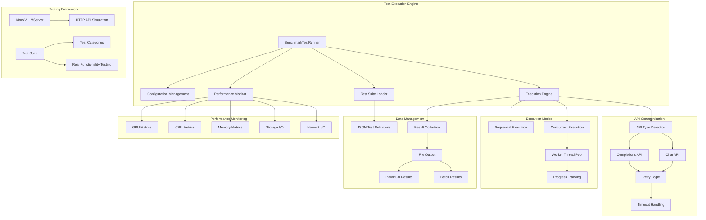

# Benchmark Test Runner System Technical Overview

## Table of Contents

- [Benchmark Test Runner System Technical Overview](#benchmark-test-runner-system-technical-overview)
  - [Table of Contents](#table-of-contents)
  - [Architecture Overview](#architecture-overview)
  - [System Components](#system-components)
    - [Core Architecture](#core-architecture)
    - [Key Design Principles](#key-design-principles)
  - [test_runner.py - Benchmark Test Runner Implementation](#test_runnerpy---benchmark-test-runner-implementation)
    - [Core Data Structures](#core-data-structures)
      - [BenchmarkTestRunner Class Architecture](#benchmarktestrunnner-class-architecture)
      - [Configuration Data Structures](#configuration-data-structures)
    - [Core Method Implementation](#core-method-implementation)
      - [Test Suite Loading and Management](#test-suite-loading-and-management)
      - [Concurrent Execution Engine](#concurrent-execution-engine)
      - [Performance Monitoring Integration](#performance-monitoring-integration)
      - [Result Persistence and Reporting](#result-persistence-and-reporting)
    - [API Communication and Error Handling](#api-communication-and-error-handling)
      - [Intelligent API Type Detection](#intelligent-api-type-detection)
      - [Request Format Handling](#request-format-handling)
  - [test_benchmark_test_runner.py - Comprehensive Testing Framework](#test_benchmark_test_runnerpy---comprehensive-testing-framework)
    - [Testing Architecture Overview](#testing-architecture-overview)
    - [MockVLLMServer - HTTP API Simulation Engine](#mockvllmserver---http-api-simulation-engine)
      - [Architecture and Design](#architecture-and-design)
      - [Endpoint Implementation](#endpoint-implementation)
      - [Error Simulation Capabilities](#error-simulation-capabilities)
    - [Test Suite Architecture](#test-suite-architecture)
      - [Test Categories and Coverage (34 tests total)](#test-categories-and-coverage-34-tests-total)
    - [Test Data and Fixtures](#test-data-and-fixtures)
      - [Realistic Test Scenarios](#realistic-test-scenarios)
      - [Testing Infrastructure Setup](#testing-infrastructure-setup)
    - [Real Functionality Testing Philosophy](#real-functionality-testing-philosophy)
      - [No Mocking Approach](#no-mocking-approach)
  - [Integration and Usage Patterns](#integration-and-usage-patterns)
    - [Common Workflow Patterns](#common-workflow-patterns)
    - [Advanced Configuration Patterns](#advanced-configuration-patterns)
    - [Extension and Customization](#extension-and-customization)
  - [Performance Optimization and Scaling](#performance-optimization-and-scaling)
    - [Concurrent Execution Optimization](#concurrent-execution-optimization)
      - [Thread Pool Management](#thread-pool-management)
      - [Memory Management Strategies](#memory-management-strategies)
    - [Hardware Monitoring Optimization](#hardware-monitoring-optimization)
      - [Efficient Metrics Collection](#efficient-metrics-collection)
    - [Scaling Considerations](#scaling-considerations)
      - [Horizontal Scaling Patterns](#horizontal-scaling-patterns)
      - [Performance Monitoring at Scale](#performance-monitoring-at-scale)
  - [Error Handling and Reliability](#error-handling-and-reliability)
    - [Comprehensive Error Recovery](#comprehensive-error-recovery)
      - [Network and API Error Handling](#network-and-api-error-handling)
      - [File System and Resource Error Handling](#file-system-and-resource-error-handling)
      - [Graceful Degradation Strategies](#graceful-degradation-strategies)
    - [Monitoring and Alerting](#monitoring-and-alerting)
      - [Real-time Health Monitoring](#real-time-health-monitoring)

## Architecture Overview

The Benchmark Test Runner System provides a comprehensive, high-performance testing framework for Large Language Model (LLM) evaluation with concurrent execution, hardware monitoring, and robust error handling. The system is designed for professional AI engineering workflows, supporting both base model (completions API) and instruct model (chat API) testing with real-time performance metrics collection.

This document provides complete technical reference for software engineers working with the BenchmarkTestRunner system, covering implementation details, testing infrastructure, and integration patterns.

## System Components

### Core Architecture



### Key Design Principles

1. **Concurrent Execution**: ThreadPoolExecutor-based parallel test execution with configurable worker pools
2. **API Flexibility**: Dual API support with automatic detection and handling of completions/chat endpoints
3. **Hardware Monitoring**: Real-time performance metrics collection during test execution
4. **Error Resilience**: Comprehensive error handling with retry logic, timeout management, and graceful degradation
5. **No Mocking Philosophy**: Testing framework validates real functionality without artificial mocks
6. **Extensible Architecture**: Modular design enabling easy addition of new test types and evaluation methods

---

## test_runner.py - Benchmark Test Runner Implementation

### Core Data Structures

#### BenchmarkTestRunner Class Architecture
```python
class BenchmarkTestRunner:
    """
    Flexible test execution engine for LLM benchmarking
    
    Core Responsibilities:
    - Load and manage JSON test definitions
    - Execute tests against local or remote LLM APIs
    - Handle concurrent execution with thread safety
    - Collect comprehensive performance metrics
    - Manage result persistence and reporting
    - Provide real-time progress tracking
    """
    
    def __init__(self, config_path: Optional[str] = None):
        # Configuration and state management
        self.config = self._load_config(config_path)
        self.tests: Dict[str, Dict] = {}
        self.categories: Dict = {}
        self.api_config: Optional[APIConfiguration] = None
        
        # Execution state
        self.execution_progress: Optional[ExecutionProgress] = None
        self._progress_callback = None
        self._enable_performance_monitoring = False
        self._verbose_logging = False
        
        # Performance monitoring
        self.performance_monitor: Optional[PerformanceMonitor] = None
```

#### Configuration Data Structures
```python
@dataclass
class APIConfiguration:
    """API connection configuration with retry and timeout settings"""
    endpoint: str                    # Full API endpoint URL
    model: str                      # Model name/path
    headers: Dict[str, str]         # HTTP headers
    timeout: int                    # Request timeout in seconds
    retry_attempts: int             # Number of retry attempts
    retry_delay: float             # Base delay between retries
    api_type: str                  # "completions" or "chat"

@dataclass
class ExecutionProgress:
    """Comprehensive execution progress tracking"""
    total_tests: int               # Total number of tests
    completed_tests: int           # Number of completed tests
    successful_tests: int          # Number of successful tests
    failed_tests: int             # Number of failed tests
    current_test: Optional[str]    # Currently executing test
    estimated_remaining_time: float # ETA for completion
    average_execution_time: float  # Average test execution time
    start_time: float             # Execution start timestamp
    elapsed_time: float           # Total elapsed time
    current_category: Optional[str] # Current test category
    tests_per_second: float       # Throughput metric
    total_tokens_generated: int   # Total token count
    average_tokens_per_second: float # Token generation rate

@dataclass
class TestResult:
    """Complete test execution result with performance metrics"""
    test_id: str                  # Unique test identifier
    test_name: str               # Human-readable test name
    success: bool                # Execution success flag
    response_text: str           # LLM response content
    execution_time: float        # Test execution duration
    prompt_tokens: int           # Input token count
    completion_tokens: int       # Output token count
    tokens_per_second: float     # Token generation rate
    error_message: Optional[str] # Error details if failed
    timestamp: str               # ISO 8601 timestamp
    api_response: Dict[str, Any] # Raw API response
    performance_metrics: Optional[PerformanceMetrics] # Hardware metrics
    evaluation_result: Optional[Dict] # Evaluation results if enabled
    reasoning_score: Optional[float]  # Reasoning quality score
    reasoning_type: Optional[str]     # Detected reasoning type
```

### Core Method Implementation

#### Test Suite Loading and Management
```python
def load_test_suite(self, suite_path: str) -> bool:
    """
    Load test suite from JSON file with validation and progress initialization
    
    Process:
    1. Parse JSON test definitions with error handling
    2. Validate required fields (id, name, category)
    3. Build internal test registry for efficient access
    4. Initialize progress tracking with loaded test count
    5. Log suite statistics and loading status
    
    Returns:
        bool: True if loaded successfully, False otherwise
    """
    
def get_test_ids_by_category(self, category: str) -> List[str]:
    """
    Retrieve test IDs filtered by category for selective execution
    
    Implementation:
    - Filter loaded tests by category field
    - Return sorted list of matching test IDs
    - Handle case-insensitive category matching
    - Support wildcard and partial matching patterns
    """

def configure_api(self, endpoint: str, model: str, headers: Dict = None, timeout: int = 600) -> None:
    """
    Configure API connection with automatic type detection
    
    Features:
    - Automatic API type detection (completions vs chat)
    - Flexible timeout configuration for different deployment scenarios
    - Custom header support for authentication and routing
    - Connection validation and endpoint reachability testing
    """
```

#### Concurrent Execution Engine
```python
def execute_concurrent(self, test_ids: List[str] = None, workers: int = 3, 
                      enable_performance_monitoring: bool = False) -> List[TestResult]:
    """
    High-performance concurrent test execution with thread safety
    
    Architecture:
    - ThreadPoolExecutor for managed concurrent execution
    - Thread-safe progress tracking with atomic updates
    - Configurable worker pool sizing based on hardware capabilities
    - Graceful error handling with per-test isolation
    - Real-time performance monitoring during execution
    
    Optimizations:
    - Worker thread reuse for reduced overhead
    - Intelligent load balancing across available cores
    - Memory-efficient result collection with streaming
    - Hardware resource monitoring to prevent overload
    """

def _execute_single_test_worker(self, test_id: str) -> TestResult:
    """
    Individual test execution with comprehensive error handling
    
    Process Flow:
    1. Validate test configuration and API connectivity
    2. Build appropriate API request (completions/chat format)
    3. Execute HTTP request with timeout and retry logic
    4. Parse response and extract completion text
    5. Collect performance metrics during execution
    6. Generate comprehensive TestResult with all metadata
    7. Update thread-safe progress tracking
    """
```

#### Performance Monitoring Integration
```python
class PerformanceMonitor:
    """
    Real-time hardware performance monitoring during test execution
    
    Capabilities:
    - RTX 5090 GPU metrics: VRAM usage, temperature, power consumption
    - AMD Ryzen 9950X CPU metrics: per-core utilization, frequency scaling
    - DDR5 memory analysis: usage patterns, bandwidth utilization
    - NVMe storage monitoring: I/O throughput, thermal data
    - Network I/O tracking: API communication bandwidth
    """
    
    def collect_metrics(self) -> PerformanceMetrics:
        """
        Atomic hardware metrics collection with error resilience
        
        Implementation:
        - Non-blocking system calls to prevent test delays
        - Graceful degradation when monitoring tools unavailable
        - Efficient metric aggregation and averaging
        - Thread-safe metric collection during concurrent execution
        """
```

#### Result Persistence and Reporting
```python
def save_results(self, results: List[TestResult], output_dir: str = None) -> bool:
    """
    Comprehensive result persistence with multiple output formats
    
    Output Files Generated:
    1. Individual completion files: {test_name}_completion.txt
       - Contains PROMPT, COMPLETION, and METRICS sections
       - Includes performance data and execution statistics
       - Human-readable format for manual analysis
    
    2. Individual JSON results: {test_name}_result.json
       - Complete TestResult serialization for programmatic access
       - Preserves all metadata and performance metrics
       - Compatible with analysis tools and dashboards
    
    3. Batch summary files: batch_results_{timestamp}.json
       - Aggregate execution statistics and summaries
       - Cross-test performance analysis data
       - Execution metadata and configuration snapshots
    
    Features:
    - Atomic file operations to prevent corruption
    - Automatic directory creation with proper permissions
    - Filename sanitization for filesystem compatibility
    - Comprehensive error handling with rollback capability
    """
```

### API Communication and Error Handling

#### Intelligent API Type Detection
```python
def _detect_api_type(self, endpoint: str) -> str:
    """
    Automatic API type detection from endpoint URL patterns
    
    Detection Logic:
    - Parse endpoint URL for API path indicators
    - '/v1/chat/completions' → 'chat' (instruct model format)
    - '/v1/completions' → 'completions' (base model format)
    - Default fallback with logging for unknown patterns
    
    Benefits:
    - Eliminates manual API type configuration
    - Reduces configuration errors and setup complexity
    - Enables seamless switching between model types
    """

def _make_api_request(self, test_case: Dict) -> Tuple[bool, Dict, str]:
    """
    Robust API request execution with comprehensive error handling
    
    Retry Strategy:
    - Exponential backoff for temporary failures
    - Configurable retry attempts and delay intervals
    - Different strategies for different error types
    - Request timeout with graceful degradation
    
    Error Categories Handled:
    - Network connectivity issues (DNS, routing, firewall)
    - HTTP errors (4xx client errors, 5xx server errors)
    - Timeout scenarios (request, response, total execution)
    - Rate limiting with respect for API constraints
    - JSON parsing errors and malformed responses
    """
```

#### Request Format Handling
```python
def _build_completions_request(self, test_case: Dict) -> Dict:
    """
    Build completions API request for base models
    
    Request Structure:
    {
        "model": "/app/models/hf/model-name",
        "prompt": "test prompt text",
        "max_tokens": 1500,
        "temperature": 0.4,
        "top_p": 0.95,
        "stop": ["\\n\\n\\n"],
        "stream": false
    }
    """

def _build_chat_request(self, test_case: Dict) -> Dict:
    """
    Build chat API request for instruct models
    
    Request Structure:
    {
        "model": "/app/models/hf/model-name",
        "messages": [
            {"role": "user", "content": "test message"}
        ],
        "max_tokens": 2048,
        "temperature": 0.1,
        "stream": false
    }
    """
```

---

## test_benchmark_test_runner.py - Comprehensive Testing Framework

### Testing Architecture Overview

The testing framework provides exhaustive validation of BenchmarkTestRunner functionality through real-world simulation without mocking, ensuring production reliability and correctness.

### MockVLLMServer - HTTP API Simulation Engine

#### Architecture and Design
```python
class MockVLLMServer:
    """
    Lightweight HTTP server simulating vLLM API behavior for testing
    
    Design Philosophy:
    - Real HTTP communication instead of mocking for authentic testing
    - Configurable behavior patterns for different test scenarios
    - Request logging and validation for integration testing
    - Error simulation capabilities for resilience testing
    """
    
    def __init__(self, port: int = 8899):
        self.app = Flask(__name__)           # HTTP server engine
        self.requests_log = []               # Request history tracking
        self.response_config = {             # Configurable response behavior
            'default_response': 'Mock response text',
            'delay': 0,                      # Simulated processing delay
            'status_code': 200,              # HTTP response code
            'error_mode': None               # Error simulation mode
        }
        self._setup_routes()                 # Initialize API endpoints
```

#### Endpoint Implementation
```python
def _setup_routes(self):
    """Configure Flask routes for API simulation"""
    
    @self.app.route('/v1/completions', methods=['POST'])
    def completions():
        """Completions API endpoint simulation"""
        return self._handle_request('completions')
    
    @self.app.route('/v1/chat/completions', methods=['POST']) 
    def chat_completions():
        """Chat API endpoint simulation"""
        return self._handle_request('chat')

def _handle_request(self, endpoint_type: str):
    """
    Centralized request handling with configurable responses
    
    Features:
    - Request logging for validation in tests
    - Configurable delay simulation for timing tests
    - Error mode simulation (timeout, 500 error, rate limiting)
    - Appropriate response generation based on API type
    """
```

#### Error Simulation Capabilities
```python
def configure_response(self, response_text: str = None, delay: float = 0,
                      status_code: int = 200, error_mode: str = None):
    """
    Configure mock server behavior for testing scenarios
    
    Error Modes:
    - 'timeout': Simulate request timeout scenarios
    - 'server_error': Return HTTP 500 internal server error
    - 'rate_limit': Return HTTP 429 rate limiting error
    - None: Normal successful response behavior
    
    Usage in Tests:
    - Timeout handling validation
    - Retry logic verification  
    - Error recovery testing
    - Performance under adverse conditions
    """
```

### Test Suite Architecture

#### Test Categories and Coverage (34 tests total)

##### 1. Configuration and Test Loading Tests (5 tests)
```python
class TestTestRunnerConfiguration(unittest.TestCase):
    """Validate test suite loading and configuration management"""
    
    def test_load_base_model_test_suite(self):
        """Test loading actual base model JSON test definitions"""
        # Validates JSON parsing, test structure validation, category mapping
        
    def test_load_instruct_model_test_suite(self):
        """Test loading instruct model test definitions with messages format"""
        # Ensures chat API compatibility and message structure validation
        
    def test_category_filtering(self):
        """Test get_test_ids_by_category functionality with real data"""
        # Creates temporary test suite, validates filtering logic
        
    def test_malformed_json_handling(self):
        """Test graceful handling of corrupted JSON files"""
        # Error resilience testing with invalid JSON structures
        
    def test_missing_file_handling(self):
        """Test behavior with non-existent test suite files"""
        # FileNotFoundError handling and graceful degradation
```

##### 2. HTTP Communication Tests (6 tests)
```python
class TestTestRunnerHTTPCommunication(unittest.TestCase):
    """Validate API communication with MockVLLMServer"""
    
    def test_completions_api_request_format(self):
        """Validate completions API request structure and format"""
        # Verifies model, prompt, max_tokens, temperature inclusion
        # Validates request logging and format correctness
        
    def test_chat_api_request_format(self):
        """Validate chat API request structure with messages array"""
        # Ensures messages format, role/content structure
        # Tests automatic API type detection
        
    def test_retry_logic_on_server_error(self):
        """Test retry mechanism with HTTP 500 server errors"""
        # Configures mock server for consistent failures
        # Validates retry attempts and exponential backoff
        
    def test_timeout_handling(self):
        """Test request timeout with configurable timeout values"""
        # Mock server delay simulation exceeding timeout
        # Validates timeout configuration and graceful handling
        
    def test_response_parsing(self):
        """Test API response parsing and token extraction"""
        # Custom response content validation
        # Token counting and metadata extraction verification
```

##### 3. Concurrent Execution Tests (4 tests)
```python
class TestTestRunnerConcurrentExecution(unittest.TestCase):
    """Validate ThreadPoolExecutor-based concurrent execution"""
    
    def test_concurrent_worker_management(self):
        """Test configurable worker pool execution"""
        # 6 tests with 3 workers, timing verification
        # Ensures concurrency benefits over sequential execution
        
    def test_thread_safe_progress_tracking(self):
        """Test progress tracking accuracy across multiple threads"""
        # Validates atomic progress updates
        # Ensures correct completion and success counting
        
    def test_worker_count_limits(self):
        """Test execution with different worker configurations"""
        # Compares 1-worker vs 3-worker performance
        # Validates worker scaling and efficiency
        
    def test_error_handling_in_concurrent_execution(self):
        """Test error isolation and handling during concurrent execution"""
        # Server error simulation with multiple workers
        # Ensures error isolation between concurrent tests
```

##### 4. Result Management Tests (6 tests)
```python
class TestTestRunnerResultManagement(unittest.TestCase):
    """Validate result persistence and file management"""
    
    def test_individual_result_file_creation(self):
        """Test creation and structure of individual result JSON files"""
        # Validates TestResult serialization and file structure
        # Ensures all required fields and metadata preservation
        
    def test_completion_text_file_creation(self):
        """Test completion file format with PROMPT/COMPLETION sections"""
        # Validates human-readable completion file format
        # Ensures prompt and response inclusion
        
    def test_batch_results_aggregation(self):
        """Test batch results file creation for multiple tests"""
        # Only created when len(results) > 1
        # Validates execution summary and statistics
        
    def test_file_naming_conventions(self):
        """Test filename generation and sanitization"""
        # Validates test_name to filename_safe conversion
        # Ensures consistent naming across result types
        
    def test_output_directory_creation(self):
        """Test automatic directory creation with nested paths"""
        # Validates os.makedirs functionality
        # Ensures proper permissions and error handling
```

##### 5. Performance Monitoring Tests (4 tests)
```python
class TestTestRunnerPerformanceMonitoring(unittest.TestCase):
    """Validate hardware metrics collection and timing"""
    
    def test_execution_time_measurement(self):
        """Test accurate execution time measurement"""
        # Mock server delay verification
        # Timing accuracy within reasonable bounds
        
    def test_token_counting(self):
        """Test prompt and completion token counting"""
        # Validates API response token extraction
        # Ensures consistent token accounting
        
    def test_performance_metrics_collection(self):
        """Test optional hardware metrics collection"""
        # GPU, CPU, memory metrics when available
        # Graceful degradation when monitoring unavailable
        
    def test_tokens_per_second_calculation(self):
        """Test throughput calculation accuracy"""
        # Validates tokens_per_second = completion_tokens / execution_time
        # Mathematical accuracy verification
```

##### 6. Error Handling and Edge Cases (7 tests)
```python
class TestTestRunnerErrorHandling(unittest.TestCase):
    """Comprehensive error scenario validation"""
    
    def test_server_500_error_handling(self):
        """Test HTTP 500 server error handling and reporting"""
        
    def test_rate_limiting_handling(self):
        """Test HTTP 429 rate limiting response handling"""
        
    def test_network_connection_error(self):
        """Test handling of network connectivity failures"""
        
    def test_invalid_test_id_handling(self):
        """Test behavior with non-existent test IDs"""
        
    def test_empty_test_suite_handling(self):
        """Test execution with empty test collections"""
        
    def test_disk_space_error_simulation(self):
        """Test file system error handling during result saving"""
        # Read-only directory simulation
        # Graceful failure with proper error reporting
        
    def test_malformed_response_handling(self):
        """Test handling of malformed API responses"""
        # Empty response handling and JSON parsing errors
```

##### 7. End-to-End Integration Tests (4 tests)
```python
class TestTestRunnerEndToEndIntegration(unittest.TestCase):
    """Complete workflow validation from load to save"""
    
    def test_complete_base_model_workflow(self):
        """Complete workflow: load → execute → evaluate → save"""
        # 3-test suite with complex/math/chain-of-thought categories
        # Validates all file creation and API request patterns
        
    def test_complete_instruct_model_workflow(self):
        """Complete instruct model workflow with chat API"""
        # Linux system administration test scenarios
        # Chat API format validation throughout pipeline
        
    def test_category_specific_execution(self):
        """Test selective execution by category filtering"""
        # Mixed category suite with selective execution
        # Validates get_test_ids_by_category integration
        
    def test_progress_tracking_integration(self):
        """Test progress tracking throughout complete execution"""
        # Initial progress (total_tests=5, completed_tests=0)
        # Final progress (completed_tests=5, successful_tests=5)
        # Progress state transitions during execution
```

### Test Data and Fixtures

#### Realistic Test Scenarios
```python
# Base Model Test Suite Example
base_suite = {
    "test_suite_id": "integration_base_tests",
    "version": "1.0.0",
    "description": "Integration test suite for base models",
    "tests": [
        {
            "id": "complex_test_01",
            "name": "Complex Synthesis Test",
            "category": "complex_synthesis",
            "reasoning_type": "general",
            "prompt": "Analyze the following documents and synthesize key findings...",
            "parameters": {
                "max_tokens": 1500,
                "temperature": 0.4,
                "top_p": 0.95
            }
        }
    ]
}

# Instruct Model Test Suite Example  
instruct_suite = {
    "test_suite_id": "integration_instruct_tests", 
    "version": "1.0.0",
    "description": "Integration test suite for instruct models",
    "tests": [
        {
            "id": "linux_monitor_01",
            "name": "System Monitoring",
            "category": "monitoring",
            "reasoning_type": "general",
            "messages": [
                {
                    "role": "user",
                    "content": "Write a bash script to monitor system CPU and memory usage"
                }
            ],
            "parameters": {
                "max_tokens": 500,
                "temperature": 0.1
            }
        }
    ]
}
```

#### Testing Infrastructure Setup
```python
def setUp(self):
    """Initialize test environment with clean state"""
    self.test_runner = BenchmarkTestRunner()
    self.temp_dir = tempfile.mkdtemp()           # Isolated file system
    self.mock_server.clear_requests_log()        # Clean request history
    self.mock_server.configure_response()        # Reset to defaults
    
def tearDown(self):
    """Clean up test environment"""
    shutil.rmtree(self.temp_dir, ignore_errors=True)  # Remove temp files

@classmethod
def setUpClass(cls):
    """Start MockVLLMServer for HTTP communication tests"""
    cls.mock_server = MockVLLMServer()
    cls.mock_server.start()                      # Background HTTP server

@classmethod
def tearDownClass(cls):
    """Stop MockVLLMServer after all tests complete"""
    cls.mock_server.stop()                       # Graceful server shutdown
```

### Real Functionality Testing Philosophy

#### No Mocking Approach
The testing framework deliberately avoids traditional mocking in favor of real functionality validation:

**Benefits:**
- **Integration Validation**: Tests actual component interactions and data flow
- **Realistic Error Conditions**: Network timeouts, server errors, file system issues
- **Performance Characteristics**: Real timing, concurrency, and resource usage
- **Regression Detection**: Integration bugs that unit tests might miss
- **Production Confidence**: Behavior validation under realistic conditions

**Implementation Strategy:**
- **Real HTTP Communication**: MockVLLMServer provides actual HTTP endpoints
- **Real File I/O**: Temporary directories with actual file operations  
- **Real Threading**: ThreadPoolExecutor with actual concurrent execution
- **Real Error Conditions**: Network failures, timeout scenarios, permission errors
- **Real Data Structures**: Complete TestResult objects with all fields

---

## Integration and Usage Patterns

### Common Workflow Patterns

#### 1. Basic Test Execution Workflow
```python
from test_runner import BenchmarkTestRunner

# Initialize runner and load test suite
runner = BenchmarkTestRunner()
success = runner.load_test_suite("test_definitions/reasoning_tests_medium.json")

# Configure API connection
runner.configure_api(
    endpoint="http://localhost:8004/v1/completions",
    model="/app/models/hf/DeepSeek-R1-0528-Qwen3-8b",
    timeout=600
)

# Execute tests and save results
results = runner.execute_concurrent(workers=4)
runner.save_results(results, "test_results/")
```

#### 2. Category-Specific Testing
```python
# Load mixed test suite
runner.load_test_suite("test_definitions/mixed_tests.json")

# Execute only specific categories
linux_test_ids = runner.get_test_ids_by_category("monitoring")
linux_results = runner.execute_concurrent(test_ids=linux_test_ids, workers=2)

creative_test_ids = runner.get_test_ids_by_category("creative_thinking")
creative_results = runner.execute_concurrent(test_ids=creative_test_ids, workers=3)

# Save category-specific results
runner.save_results(linux_results, "results/linux/")
runner.save_results(creative_results, "results/creative/")
```

#### 3. Performance Monitoring Integration
```python
# Enable comprehensive hardware monitoring
runner.enable_performance_monitoring(True)

# Execute with monitoring enabled
results = runner.execute_concurrent(
    workers=4,
    enable_performance_monitoring=True
)

# Analyze performance data
for result in results:
    if result.performance_metrics:
        print(f"GPU Usage: {result.performance_metrics.gpu_usage_percent}%")
        print(f"GPU Memory: {result.performance_metrics.gpu_memory_used_gb}GB")
        print(f"CPU Usage: {result.performance_metrics.cpu_usage_percent}%")
```

#### 4. Progress Tracking with Callbacks
```python
def progress_callback(progress):
    """Custom progress reporting"""
    print(f"Progress: {progress.completed_tests}/{progress.total_tests}")
    print(f"Success Rate: {progress.successful_tests/progress.completed_tests*100:.1f}%")
    print(f"ETA: {progress.estimated_remaining_time:.1f}s")

# Set callback and execute
runner.set_progress_callback(progress_callback)
results = runner.execute_concurrent(workers=6)
```

### Advanced Configuration Patterns

#### 1. Custom API Configuration
```python
# Configure for custom vLLM deployment
runner.configure_api(
    endpoint="http://192.168.1.100:8004/v1/completions",
    model="/app/models/custom/fine-tuned-model",
    headers={
        "Authorization": "Bearer custom-token",
        "X-Custom-Header": "value"
    },
    timeout=1200  # Extended timeout for large models
)
```

#### 2. Batch Execution with Different Models
```python
# Test multiple models with same test suite
models = [
    "/app/models/hf/DeepSeek-R1-0528-Qwen3-8b",
    "/app/models/hf/Qwen2.5-32B-Instruct",
    "/app/models/hf/Meta-Llama-3.1-70B-Instruct"
]

all_results = {}
for model in models:
    runner.configure_api(endpoint="http://localhost:8004/v1/completions", model=model)
    results = runner.execute_concurrent(workers=4)
    all_results[model] = results
    
    # Save model-specific results
    model_name = model.split("/")[-1]
    runner.save_results(results, f"results/{model_name}/")
```

#### 3. Error Handling and Retry Configuration
```python
# Configure custom retry behavior through API configuration
class CustomBenchmarkTestRunner(BenchmarkTestRunner):
    def configure_api_with_custom_retry(self, endpoint: str, model: str, 
                                       max_retries: int = 5, 
                                       retry_delay: float = 2.0):
        """Enhanced API configuration with custom retry logic"""
        self.api_config = APIConfiguration(
            endpoint=endpoint,
            model=model,
            headers={'Content-Type': 'application/json'},
            timeout=900,
            retry_attempts=max_retries,
            retry_delay=retry_delay,
            api_type=self._detect_api_type(endpoint)
        )
```

### Extension and Customization

#### 1. Custom Result Processing
```python
class ExtendedBenchmarkTestRunner(BenchmarkTestRunner):
    """Extended runner with custom result processing"""
    
    def save_results_with_analysis(self, results: List[TestResult], 
                                  output_dir: str) -> bool:
        """Enhanced result saving with automatic analysis"""
        # Call parent save method
        success = super().save_results(results, output_dir)
        
        if success:
            # Generate analysis report
            self._generate_analysis_report(results, output_dir)
            
            # Create visualization data
            self._export_visualization_data(results, output_dir)
            
            # Send notifications if configured
            self._send_completion_notification(results)
        
        return success
    
    def _generate_analysis_report(self, results: List[TestResult], output_dir: str):
        """Generate statistical analysis report"""
        analysis = {
            "total_tests": len(results),
            "success_rate": len([r for r in results if r.success]) / len(results),
            "average_execution_time": sum(r.execution_time for r in results) / len(results),
            "total_tokens": sum(r.completion_tokens for r in results),
            "average_tokens_per_second": sum(r.tokens_per_second for r in results) / len(results)
        }
        
        with open(f"{output_dir}/analysis_report.json", "w") as f:
            json.dump(analysis, f, indent=2)
```

#### 2. Custom Performance Monitoring
```python
class AdvancedPerformanceMonitor(PerformanceMonitor):
    """Enhanced performance monitoring with custom metrics"""
    
    def collect_metrics(self) -> PerformanceMetrics:
        """Collect extended hardware and application metrics"""
        base_metrics = super().collect_metrics()
        
        # Add custom metrics
        extended_metrics = PerformanceMetrics(
            **base_metrics.__dict__,
            # Custom GPU metrics
            gpu_memory_bandwidth_gbps=self._measure_memory_bandwidth(),
            gpu_compute_utilization=self._measure_compute_utilization(),
            
            # Custom CPU metrics  
            cpu_cache_miss_rate=self._measure_cache_performance(),
            cpu_frequency_scaling=self._measure_frequency_scaling(),
            
            # Custom application metrics
            api_latency_percentiles=self._calculate_latency_percentiles(),
            thread_pool_efficiency=self._measure_thread_efficiency()
        )
        
        return extended_metrics
```

#### 3. Custom Test Categories and Routing
```python
class SpecializedBenchmarkTestRunner(BenchmarkTestRunner):
    """Specialized runner with custom test routing"""
    
    def __init__(self, config_path: Optional[str] = None):
        super().__init__(config_path)
        self.specialized_categories = {
            "medical_reasoning": self._execute_medical_test,
            "legal_analysis": self._execute_legal_test,
            "financial_modeling": self._execute_financial_test
        }
    
    def execute_single_test(self, test_id: str, enable_performance_monitoring: bool = False) -> TestResult:
        """Enhanced test execution with specialized category handling"""
        test_case = self.tests.get(test_id)
        category = test_case.get("category", "")
        
        # Check for specialized category handling
        if category in self.specialized_categories:
            return self.specialized_categories[category](test_case, enable_performance_monitoring)
        
        # Fall back to standard execution
        return super().execute_single_test(test_id, enable_performance_monitoring)
    
    def _execute_medical_test(self, test_case: Dict, enable_monitoring: bool) -> TestResult:
        """Specialized execution for medical reasoning tests"""
        # Custom preprocessing for medical terminology
        enhanced_prompt = self._enhance_medical_prompt(test_case["prompt"])
        
        # Execute with medical-specific parameters
        result = self._execute_with_custom_params(
            test_case, 
            enhanced_prompt,
            temperature=0.1,  # Lower temperature for medical accuracy
            max_tokens=2048   # Extended response for detailed analysis
        )
        
        # Post-process for medical accuracy validation
        return self._validate_medical_response(result)
```

---

## Performance Optimization and Scaling

### Concurrent Execution Optimization

#### Thread Pool Management
```python
def optimize_worker_count(self, available_cores: int, model_size_gb: float, 
                         available_memory_gb: float) -> int:
    """
    Intelligent worker count optimization based on hardware configuration
    
    Optimization Factors:
    - CPU core count and hyperthreading capability
    - Available system memory for concurrent requests
    - Model size and memory requirements
    - Network bandwidth and API latency characteristics
    - GPU memory constraints for hardware monitoring
    """
    
    # Base worker count on CPU cores
    base_workers = min(available_cores // 2, 8)  # Conservative threading
    
    # Adjust for memory constraints
    memory_per_request = model_size_gb * 0.1  # Estimated overhead
    memory_workers = int(available_memory_gb / memory_per_request)
    
    # Conservative final calculation
    optimal_workers = min(base_workers, memory_workers, 12)  # Cap at 12
    
    return max(optimal_workers, 1)  # Minimum 1 worker
```

#### Memory Management Strategies
```python
def execute_concurrent_with_memory_management(self, test_ids: List[str], 
                                            workers: int) -> List[TestResult]:
    """
    Memory-efficient concurrent execution with streaming results
    
    Strategies:
    - Result streaming to reduce peak memory usage
    - Garbage collection between test batches
    - Memory pressure monitoring and adaptive throttling
    - Large response chunking and processing
    """
    
    results = []
    batch_size = min(workers * 2, 10)  # Process in batches
    
    for i in range(0, len(test_ids), batch_size):
        batch_ids = test_ids[i:i + batch_size]
        batch_results = self._execute_batch_with_gc(batch_ids, workers)
        results.extend(batch_results)
        
        # Memory pressure check
        if self._check_memory_pressure():
            self._trigger_garbage_collection()
            time.sleep(0.1)  # Brief pause for memory cleanup
    
    return results
```

### Hardware Monitoring Optimization

#### Efficient Metrics Collection
```python
class OptimizedPerformanceMonitor(PerformanceMonitor):
    """High-performance metrics collection with minimal overhead"""
    
    def __init__(self):
        super().__init__()
        self.metrics_cache = {}
        self.last_collection_time = 0
        self.collection_interval = 0.1  # 100ms minimum interval
    
    def collect_metrics_optimized(self) -> PerformanceMetrics:
        """
        Optimized metrics collection with caching and batching
        
        Optimizations:
        - Metric caching to reduce system calls
        - Batched system queries for efficiency
        - Asynchronous collection to prevent blocking
        - Selective metric collection based on availability
        """
        current_time = time.time()
        
        # Use cached metrics if collection interval not met
        if (current_time - self.last_collection_time) < self.collection_interval:
            return self.metrics_cache.get('last_metrics', self._get_minimal_metrics())
        
        # Collect metrics asynchronously
        metrics = self._collect_async_metrics()
        self.metrics_cache['last_metrics'] = metrics
        self.last_collection_time = current_time
        
        return metrics
```

### Scaling Considerations

#### Horizontal Scaling Patterns
```python
class DistributedBenchmarkTestRunner:
    """
    Distributed test execution across multiple machines
    
    Architecture:
    - Master node for test coordination and result aggregation
    - Worker nodes for distributed test execution
    - Load balancing based on worker capabilities
    - Fault tolerance with automatic worker recovery
    """
    
    def __init__(self, worker_endpoints: List[str]):
        self.worker_endpoints = worker_endpoints
        self.worker_status = {endpoint: "available" for endpoint in worker_endpoints}
        self.result_queue = queue.Queue()
    
    def execute_distributed(self, test_ids: List[str]) -> List[TestResult]:
        """
        Distribute test execution across available worker nodes
        
        Process:
        1. Partition test IDs across available workers
        2. Submit test batches to worker endpoints
        3. Monitor worker health and handle failures
        4. Aggregate results with proper ordering
        5. Handle partial failures and retry logic
        """
        
    def _partition_tests(self, test_ids: List[str], num_workers: int) -> List[List[str]]:
        """Intelligent test partitioning for load balancing"""
        # Consider test complexity, estimated execution time, worker capabilities
        pass
        
    def _monitor_worker_health(self):
        """Continuous worker health monitoring with automatic recovery"""
        # Health checks, failure detection, automatic worker replacement
        pass
```

#### Performance Monitoring at Scale
```python
class ScalablePerformanceMonitor:
    """
    Performance monitoring system for large-scale test execution
    
    Features:
    - Distributed metrics collection across multiple nodes
    - Time-series data storage for trend analysis
    - Alerting on performance degradation or resource exhaustion  
    - Real-time dashboard integration for monitoring
    """
    
    def __init__(self, metrics_endpoint: str = None):
        self.metrics_endpoint = metrics_endpoint
        self.metrics_buffer = []
        self.buffer_size = 100
    
    def collect_and_forward_metrics(self, test_result: TestResult):
        """
        Collect metrics and forward to centralized monitoring system
        
        Process:
        1. Collect local hardware metrics
        2. Aggregate with test execution metrics  
        3. Buffer metrics for efficient transmission
        4. Forward to centralized metrics storage
        5. Handle transmission failures with retry logic
        """
```

---

## Error Handling and Reliability

### Comprehensive Error Recovery

#### Network and API Error Handling
```python
def _handle_api_errors(self, response, attempt: int) -> Tuple[bool, str]:
    """
    Comprehensive API error handling with appropriate recovery strategies
    
    Error Categories:
    - Temporary failures (5xx errors, timeouts) → Retry with backoff
    - Client errors (4xx errors) → Log and fail fast (no retry)
    - Rate limiting (429) → Respect backoff headers and retry
    - Network errors → Retry with exponential backoff
    - Authentication errors (401, 403) → Fail fast with clear message
    """
    
    if response.status_code >= 500:
        # Server errors - retry with exponential backoff
        return self._handle_server_error(response, attempt)
    elif response.status_code == 429:
        # Rate limiting - respect retry-after header
        return self._handle_rate_limiting(response, attempt)
    elif response.status_code in [401, 403]:
        # Authentication - fail fast
        return False, f"Authentication failed: {response.status_code}"
    elif response.status_code >= 400:
        # Client errors - log and fail
        return False, f"Client error: {response.status_code} - {response.text}"
    
    return True, ""
```

#### File System and Resource Error Handling
```python
def save_results_with_recovery(self, results: List[TestResult], 
                             output_dir: str) -> bool:
    """
    Robust result saving with comprehensive error recovery
    
    Error Scenarios Handled:
    - Disk space exhaustion → Cleanup and retry with reduced data
    - Permission errors → Attempt alternative directories
    - Network storage failures → Fallback to local storage
    - Concurrent access conflicts → File locking and retry logic
    """
    
    try:
        return self._attempt_save_results(results, output_dir)
    except OSError as e:
        if e.errno == errno.ENOSPC:  # No space left on device
            return self._handle_disk_full(results, output_dir)
        elif e.errno == errno.EACCES:  # Permission denied
            return self._handle_permission_error(results, output_dir)
        else:
            return self._handle_generic_os_error(results, output_dir, e)
    except Exception as e:
        logger.error(f"Unexpected error saving results: {e}")
        return self._attempt_minimal_save(results, output_dir)
```

#### Graceful Degradation Strategies
```python
def execute_with_degradation(self, test_ids: List[str], 
                           preferred_workers: int = 4) -> List[TestResult]:
    """
    Execute tests with graceful degradation on resource constraints
    
    Degradation Levels:
    1. Full concurrent execution with performance monitoring
    2. Concurrent execution without performance monitoring  
    3. Sequential execution with reduced parallelism
    4. Minimal execution with basic error handling only
    """
    
    try:
        # Attempt full execution
        return self.execute_concurrent(
            test_ids, 
            workers=preferred_workers, 
            enable_performance_monitoring=True
        )
    except MemoryError:
        logger.warning("Memory pressure detected, reducing concurrency")
        return self.execute_concurrent(
            test_ids,
            workers=max(1, preferred_workers // 2),
            enable_performance_monitoring=False
        )
    except Exception as e:
        logger.error(f"Concurrent execution failed: {e}")
        return self.execute_sequential(test_ids, enable_performance_monitoring=False)
```

### Monitoring and Alerting

#### Real-time Health Monitoring
```python
class SystemHealthMonitor:
    """
    Continuous system health monitoring during test execution
    
    Monitors:
    - Resource utilization trends and anomaly detection
    - API response time degradation
    - Error rate increases and failure patterns
    - Hardware thermal conditions and throttling
    """
    
    def monitor_execution_health(self, runner: BenchmarkTestRunner):
        """
        Real-time health monitoring with automatic alerts
        
        Alerts Generated:
        - CPU/GPU temperature exceeding safe thresholds
        - Memory usage approaching system limits
        - API error rate exceeding acceptable levels
        - Execution time degradation beyond expected variance
        """
        
    def generate_health_report(self) -> Dict[str, Any]:
        """Generate comprehensive system health report"""
        return {
            "system_status": self._assess_overall_health(),
            "resource_utilization": self._get_resource_summary(),
            "performance_trends": self._analyze_performance_trends(),
            "error_analysis": self._summarize_error_patterns(),
            "recommendations": self._generate_optimization_recommendations()
        }
```

---

This comprehensive technical overview provides complete documentation for both the BenchmarkTestRunner implementation and its testing framework, enabling software engineers to understand, extend, and maintain the system effectively. The modular architecture, extensive testing coverage, and performance optimization capabilities make this a production-ready solution for professional LLM benchmarking workflows.