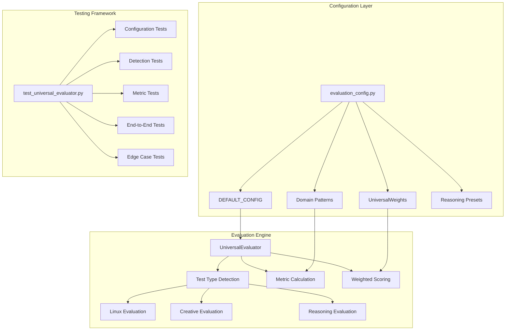

# Universal Evaluation System Technical Overview

## Table of Contents

1. [Architecture Overview](#architecture-overview)
   - [System Components](#system-components)
   - [Core Architecture](#core-architecture)
   - [Key Design Principles](#key-design-principles)

2. [evaluation_config.py - Configuration Management System](#evaluation_configpy---configuration-management-system)
   - [Core Configuration Classes](#core-configuration-classes)
   - [DEFAULT_CONFIG Structure](#default_config-structure)
   - [Configuration Presets](#configuration-presets)

3. [reasoning_evaluator.py - Universal Evaluation Engine](#reasoning_evaluatorpy---universal-evaluation-engine)
   - [UniversalEvaluator Class Architecture](#universalevaluator-class-architecture)
   - [Core Data Structures](#core-data-structures)
   - [Test Type Detection System](#test-type-detection-system)
   - [Universal Metric Calculation Algorithms](#universal-metric-calculation-algorithms)
   - [Weighted Scoring System](#weighted-scoring-system)
   - [Integration Interface](#integration-interface)

4. [test_universal_evaluator.py - Comprehensive Testing Framework](#test_universal_evaluatorpy---comprehensive-testing-framework)
   - [Test Architecture Overview](#test-architecture-overview)
   - [Test Suite Structure](#test-suite-structure)
   - [Test Data Samples](#test-data-samples)
   - [Test Execution and Validation](#test-execution-and-validation)

5. [Integration and Usage Patterns](#integration-and-usage-patterns)
   - [Common Usage Scenarios](#common-usage-scenarios)
   - [Performance Considerations](#performance-considerations)

6. [Error Handling and Debugging](#error-handling-and-debugging)
   - [Common Error Scenarios](#common-error-scenarios)
   - [Debugging Tools and Techniques](#debugging-tools-and-techniques)

7. [Extension and Customization](#extension-and-customization)
   - [Adding New Test Types](#adding-new-test-types)
   - [Custom Metric Development](#custom-metric-development)
   - [Configuration Customization](#configuration-customization)

---

## Architecture Overview

The Universal Evaluation System provides adaptive, multi-dimensional quality assessment for diverse test types including Linux system administration, creative thinking, and logical reasoning tasks. The system transforms traditional reasoning evaluation into a flexible framework that adapts scoring criteria based on test category while maintaining consistent metric structure.

This document provides a comprehensive technical reference for software engineers working with the evaluation system, covering configuration management, evaluation algorithms, and testing infrastructure.

## System Components

### Core Architecture



### Key Design Principles

1. **Universal Metrics**: Seven core metrics that adapt meaning based on test type
2. **Category-Based Detection**: Automatic test type identification from category strings
3. **Configurable Weights**: Test-type-specific weight configurations for optimal scoring
4. **Pattern Recognition**: Domain-specific pattern matching for quality assessment
5. **Extensibility**: Framework designed for easy addition of new test types

---

## evaluation_config.py - Configuration Management System

### Core Configuration Classes

#### UniversalWeights Class
```python
class UniversalWeights:
    """Default weights for universal evaluation metrics"""
    ORGANIZATION_QUALITY = 0.15      # Structure and flow clarity
    TECHNICAL_ACCURACY = 0.20        # Domain-specific correctness
    COMPLETENESS = 0.15              # Solution completeness
    THOROUGHNESS = 0.15              # Analysis depth
    RELIABILITY = 0.10               # Best practices adherence
    SCOPE_COVERAGE = 0.10            # Comprehensive coverage
    DOMAIN_APPROPRIATENESS = 0.15    # Domain-specific quality
```

**Mathematical Constraint**: All weights must sum to exactly 1.0 for proper normalization.

#### ScoreThresholds Class
```python
class ScoreThresholds:
    """Score threshold definitions for evaluation categories"""
    EXCELLENT = 85.0         # Top-tier performance threshold
    GOOD = 70.0             # Above-average performance
    SATISFACTORY = 55.0     # Acceptable performance
    POOR = 40.0             # Below-average performance
    VERY_POOR = 25.0        # Poor performance threshold
```

### DEFAULT_CONFIG Structure

The main configuration dictionary contains six primary sections:

#### 1. Universal Weights Configuration
```python
"weights": {
    "organization_quality": 0.15,
    "technical_accuracy": 0.20,
    "completeness": 0.15,
    "thoroughness": 0.15,
    "reliability": 0.10,
    "scope_coverage": 0.10,
    "domain_appropriateness": 0.15
}
```

#### 2. Test Type Specific Configurations
```python
"test_type_configs": {
    "linux": {
        "weights": {
            "organization_quality": 0.20,      # Command structure clarity
            "technical_accuracy": 0.35,        # Syntax/security correctness
            "completeness": 0.15,              # Solution completeness
            "thoroughness": 0.10,              # Documentation quality
            "reliability": 0.15,               # Security best practices
            "scope_coverage": 0.03,            # Edge case handling
            "domain_appropriateness": 0.02     # Linux terminology
        },
        "dangerous_patterns": ["rm -rf /", "chmod 777", "* * * * *"],
        "best_practices": ["error handling", "logging", "security"],
        "keywords": ["command", "script", "bash", "sudo", "systemctl"]
    },
    
    "creative": {
        "weights": {
            "organization_quality": 0.15,      # Structure and flow
            "technical_accuracy": 0.10,        # Logical coherence
            "completeness": 0.20,              # Constraint adherence
            "thoroughness": 0.25,              # Creative exploration depth
            "reliability": 0.15,               # Consistency with requirements
            "scope_coverage": 0.10,            # Breadth of ideas
            "domain_appropriateness": 0.05     # Creative language usage
        },
        "quality_indicators": ["perspective", "approach", "consideration"],
        "constraint_adherence": ["requirement", "specification", "criteria"]
    }
}
```

#### 3. Domain Pattern Recognition
```python
"domain_patterns": {
    "medical": {
        "keywords": ["diagnosis", "symptoms", "treatment", "patient"],
        "technical_terms": ["differential", "pathophysiology", "etiology"],
        "reasoning_patterns": ["history", "examination", "assessment", "plan"],
        "quality_indicators": ["systematic", "comprehensive", "evidence-based"]
    },
    
    "engineering": {
        "keywords": ["system", "design", "analysis", "specification"],
        "technical_terms": ["optimization", "constraint", "parameter"],
        "reasoning_patterns": ["requirements", "design", "implementation"],
        "quality_indicators": ["systematic", "methodical", "validated"]
    }
}
```

#### 4. Advanced Linguistic Analysis
```python
"linguistic_patterns": {
    "hedging_sophisticated": ["arguably", "presumably", "seemingly", "apparently"],
    "certainty_high": ["definitely", "certainly", "undoubtedly", "clearly"],
    "meta_cognitive": ["I need to consider", "let me think", "on reflection"],
    "self_correction": ["actually", "rather", "in fact", "more precisely"]
}
```

#### 5. Quantitative Analysis Patterns
```python
"quantitative_patterns": {
    "numerical_precision": [r"\d+\.\d+%", r"\$[\d,]+\.\d+"],
    "statistical_terms": ["correlation", "regression", "standard deviation"],
    "mathematical_operators": ["equals", "approximately", "greater than"],
    "probability_language": ["probability", "likelihood", "chance", "odds"]
}
```

### Configuration Presets

#### Specialized Configurations
- **FAST_CONFIG**: Optimized for quick evaluation with simplified patterns
- **DETAILED_CONFIG**: Comprehensive analysis with enhanced precision thresholds
- **REASONING_TYPE_PRESETS**: Category-specific configurations for academic, business, and educational contexts

---

## reasoning_evaluator.py - Universal Evaluation Engine

### UniversalEvaluator Class Architecture

```python
class UniversalEvaluator:
    """
    Universal evaluation engine that adapts assessment criteria based on test type
    
    Key Capabilities:
    - Test type detection from category strings
    - Category-specific metric calculation
    - Weighted scoring with configurable weights
    - Pattern-based quality assessment
    - Confidence scoring and detailed analysis
    """
```

### Core Data Structures

#### EvaluationMetrics Dataclass
```python
@dataclass
class EvaluationMetrics:
    organization_quality: float        # Universal structure metric
    technical_accuracy: float          # Domain-specific correctness
    completeness: float                # Solution completeness assessment
    thoroughness: float                # Analysis depth evaluation
    reliability: float                 # Best practices adherence
    scope_coverage: float              # Comprehensive coverage metric
    domain_appropriateness: float      # Domain-specific quality
    overall_score: float               # Weighted composite score
    word_count: int                    # Response length metric
    confidence_score: float            # Evaluation confidence
```

#### ReasoningResult Dataclass
```python
@dataclass
class ReasoningResult:
    metrics: EvaluationMetrics         # Complete metric set
    reasoning_type: ReasoningType      # Detected reasoning type
    detailed_analysis: str             # Comprehensive analysis text
```

### Test Type Detection System

#### Category Mapping Algorithm
```python
def _detect_test_type(self, category: Optional[str]) -> str:
    """
    Detect test type from category string using pattern matching
    
    Linux Categories:
    - log_analysis, containerization, security, monitoring
    - backup, service_management, networking, linux_monitoring
    
    Creative Categories:
    - creative_thinking, strategic_thinking, ambiguity_handling
    - metacognitive_reasoning, constraint_following
    
    Default: reasoning (all other categories)
    """
    
    if not category:
        return "reasoning"
        
    linux_categories = {
        "log_analysis", "containerization", "security", "monitoring",
        "backup", "service_management", "networking", "linux_monitoring",
        "database", "deployment", "troubleshooting", "automation"
    }
    
    creative_categories = {
        "creative_thinking", "strategic_thinking", "ambiguity_handling",
        "metacognitive_reasoning", "constraint_following"
    }
    
    if category in linux_categories:
        return "linux"
    elif category in creative_categories:
        return "creative"
    else:
        return "reasoning"
```

### Universal Metric Calculation Algorithms

#### Organization Quality Assessment
```python
def _calculate_organization_quality(self, text: str, test_type: str) -> float:
    """
    Adaptive organization quality calculation based on test type
    """
    text_lower = text.lower()  # Case-insensitive matching
    
    if test_type == "linux":
        # Linux: Command structure, syntax clarity
        linux_indicators = ["#!/bin/bash", "if", "then", "else", "for", 
                           "while", "&&", "||", "sudo", "systemctl"]
        indicator_count = sum(1 for indicator in linux_indicators 
                            if indicator in text_lower)
        return min(indicator_count * 8, 100)
        
    elif test_type == "creative":
        # Creative: Flow, structure, organization
        creative_indicators = ["\n\n", "first", "second", "finally", 
                             "however", "therefore", "in conclusion"]
        indicator_count = sum(1 for indicator in creative_indicators 
                            if indicator in text_lower)
        return min(indicator_count * 12, 100)
        
    else:
        # Reasoning: Traditional step clarity
        step_indicators = ["step", "first", "next", "then", "finally", 
                          "therefore", "thus", "hence"]
        step_count = sum(1 for indicator in step_indicators 
                        if indicator in text_lower)
        return min(step_count * 10, 100)
```

#### Technical Accuracy Assessment
```python
def _calculate_technical_accuracy(self, text: str, test_type: str) -> float:
    """
    Domain-specific technical accuracy evaluation
    """
    if test_type == "linux":
        # Linux: Command syntax, security practices
        good_commands = ["sudo", "systemctl", "grep", "awk", "sed", "chmod"]
        dangerous_patterns = ["rm -rf /", "chmod 777", "* * * * *"]
        
        good_score = sum(5 for cmd in good_commands if cmd in text)
        danger_penalty = sum(30 for pattern in dangerous_patterns if pattern in text)
        
        return max(0, min(good_score - danger_penalty, 100))
        
    elif test_type == "creative":
        # Creative: Logical coherence, creativity indicators
        creativity_markers = ["innovative", "creative", "unique", "original", 
                            "alternative", "novel", "unconventional"]
        coherence_markers = ["because", "therefore", "consequently", "thus"]
        
        creativity_score = min(len([m for m in creativity_markers if m in text.lower()]) * 8, 50)
        coherence_score = min(len([m for m in coherence_markers if m in text.lower()]) * 6, 50)
        
        return creativity_score + coherence_score
        
    else:
        # Reasoning: Logical consistency
        logic_indicators = ["because", "therefore", "thus", "hence", "given that"]
        logic_score = sum(6 for indicator in logic_indicators 
                         if indicator in text.lower())
        return min(logic_score, 100)
```

### Weighted Scoring System

#### Dynamic Weight Application
```python
def _calculate_weighted_score(self, metrics: EvaluationMetrics, test_type: str) -> float:
    """
    Apply test-type-specific weights to metrics for final scoring
    """
    # Get test-type-specific weights from configuration
    test_config = self.config.get("test_type_configs", {}).get(test_type, {})
    weights = test_config.get("weights", self.config["weights"])
    
    # Calculate weighted composite score
    weighted_score = (
        metrics.organization_quality * weights.get("organization_quality", 0.15) +
        metrics.technical_accuracy * weights.get("technical_accuracy", 0.20) +
        metrics.completeness * weights.get("completeness", 0.15) +
        metrics.thoroughness * weights.get("thoroughness", 0.15) +
        metrics.reliability * weights.get("reliability", 0.10) +
        metrics.scope_coverage * weights.get("scope_coverage", 0.10) +
        metrics.domain_appropriateness * weights.get("domain_appropriateness", 0.15)
    )
    
    return round(weighted_score, 1)
```

### Integration Interface

#### Main Evaluation Function
```python
def evaluate_reasoning(response_text: str, test_name: str, 
                      test_category: Optional[str] = None,
                      config_path: Optional[str] = None) -> ReasoningResult:
    """
    Primary interface for universal evaluation
    
    Args:
        response_text: Model response text to evaluate
        test_name: Descriptive name of the test
        test_category: Category for test type detection
        config_path: Optional custom configuration file
        
    Returns:
        ReasoningResult with complete metrics and analysis
    """
```

---

## test_universal_evaluator.py - Comprehensive Testing Framework

### Test Architecture Overview

The testing framework provides comprehensive validation of the Universal Evaluation System without mocking, ensuring real functionality testing across all components.

### Test Suite Structure

#### 1. Configuration Validation Tests (5 tests)
```python
class TestEvaluationConfig(unittest.TestCase):
    """Validate configuration mathematical correctness and completeness"""
    
    def test_universal_weights_sum_to_one(self):
        """Ensure UniversalWeights class weights sum to 1.0"""
        
    def test_default_config_weights_sum_to_one(self):
        """Verify default configuration weight normalization"""
        
    def test_all_universal_metrics_present_in_default(self):
        """Confirm all required metrics exist in default config"""
        
    def test_test_type_configs_weights_sum_to_one(self):
        """Validate test-type-specific weight configurations"""
        
    def test_all_metrics_present_in_test_type_configs(self):
        """Ensure metric completeness across test types"""
```

#### 2. Test Type Detection Tests (3 tests)
```python
class TestTypeDetection(TestUniversalEvaluator):
    """Validate category-to-test-type mapping accuracy"""
    
    def test_linux_category_detection(self):
        """Test Linux category identification"""
        linux_categories = [
            "log_analysis", "containerization", "security", 
            "monitoring", "backup", "service_management"
        ]
        
    def test_creative_category_detection(self):
        """Test creative category identification"""
        creative_categories = [
            "creative_thinking", "strategic_thinking", 
            "ambiguity_handling", "metacognitive_reasoning"
        ]
        
    def test_reasoning_category_detection(self):
        """Test default reasoning categorization"""
```

#### 3. Individual Metric Calculation Tests (5 tests)
```python
class TestMetricCalculations(TestUniversalEvaluator):
    """Test individual metric calculation algorithms"""
    
    def test_linux_technical_accuracy_good_command(self):
        """Validate Linux command quality assessment"""
        good_linux = "sudo systemctl restart nginx && systemctl status nginx"
        score = self.evaluator._calculate_technical_accuracy(good_linux, "linux")
        self.assertGreater(score, 15)
        
    def test_linux_technical_accuracy_dangerous_command(self):
        """Ensure dangerous command penalty application"""
        dangerous_linux = "rm -rf / && chmod 777 /etc/passwd"
        score = self.evaluator._calculate_technical_accuracy(dangerous_linux, "linux")
        self.assertLess(score, 50)
        
    def test_creative_organization_quality(self):
        """Test creative content organization assessment"""
        
    def test_reasoning_completeness(self):
        """Validate reasoning completeness scoring"""
        
    def test_metric_score_bounds(self):
        """Ensure all metrics return valid score ranges (0-100)"""
```

#### 4. End-to-End Integration Tests (3 tests)
```python
class TestEndToEndIntegration(TestUniversalEvaluator):
    """Test complete evaluation pipeline functionality"""
    
    def test_linux_evaluation_pipeline(self):
        """Complete Linux test evaluation workflow"""
        result = evaluate_reasoning(self.linux_sample, "Linux Test", 
                                   test_category="monitoring")
        
    def test_creative_evaluation_pipeline(self):
        """Complete creative test evaluation workflow"""
        result = evaluate_reasoning(self.creative_sample, "Creative Test",
                                   test_category="creative_thinking")
        
    def test_reasoning_evaluation_pipeline(self):
        """Complete reasoning test evaluation workflow"""
```

#### 5. Edge Case and Error Handling Tests (5 tests)
```python
class TestEdgeCases(TestUniversalEvaluator):
    """Validate robustness and error handling"""
    
    def test_empty_response(self):
        """Test evaluation of empty response"""
        result = evaluate_reasoning("", "Empty Test")
        self.assertEqual(result.metrics.overall_score, 0)
        
    def test_very_short_response(self):
        """Test single-word response handling"""
        
    def test_very_long_response(self):
        """Test long response processing (1000+ words)"""
        
    def test_none_category_handling(self):
        """Test None category graceful handling"""
        
    def test_unknown_category_handling(self):
        """Test unknown category default behavior"""
```

#### 6. Score Reasonableness Tests (5 tests)
```python
class TestScoreReasonableness(TestUniversalEvaluator):
    """Validate scoring logic and comparative analysis"""
    
    def test_better_linux_scores_higher(self):
        """Ensure quality differentiation in Linux responses"""
        good_result = evaluate_reasoning(self.linux_sample, "Linux Test", 
                                       test_category="monitoring")
        poor_result = evaluate_reasoning(self.poor_linux_sample, "Linux Test",
                                       test_category="monitoring")
        self.assertGreater(good_result.metrics.overall_score, 
                          poor_result.metrics.overall_score)
        
    def test_better_reasoning_scores_higher(self):
        """Validate reasoning quality differentiation"""
        
    def test_creative_response_appropriateness(self):
        """Test creative response scoring appropriateness"""
        
    def test_score_consistency(self):
        """Ensure identical input produces identical scores"""
        
    def test_different_categories_different_scores(self):
        """Validate test type affects scoring appropriately"""
```

### Test Data Samples

#### Comprehensive Test Samples
```python
class TestUniversalEvaluator(unittest.TestCase):
    def setUp(self):
        """Initialize test samples for different test types"""
        
        # Linux system administration sample
        self.linux_sample = """#!/bin/bash
# System health monitoring script

# Check CPU usage
cpu_usage=$(top -bn1 | grep 'Cpu(s)' | awk '{print $2}' | sed 's/%us,//')
if [ ${cpu_usage%.*} -gt 80 ]; then
    echo "WARNING: CPU usage is high: ${cpu_usage}%"
    logger "High CPU usage detected: ${cpu_usage}%"
fi

# Check memory usage with error handling
memory_usage=$(free | grep Mem | awk '{printf "%.2f", $3/$2 * 100.0}')
if [ ${memory_usage%.*} -gt 90 ]; then
    echo "WARNING: Memory usage is high: ${memory_usage}%"
    logger "High memory usage detected: ${memory_usage}%"
fi

echo "System health check completed successfully"
exit 0"""

        # Creative thinking sample
        self.creative_sample = """Here's an innovative approach to this creative challenge.

First, let me explore various perspectives:
1. Traditional approach following conventional methods
2. Lateral thinking from unexpected angles  
3. Synthesis approach combining disparate elements creatively

However, I want to explore more unconventional alternatives that could yield unique results.

Therefore, I propose this comprehensive creative solution that addresses all requirements while maintaining innovative integrity."""

        # Reasoning analysis sample  
        self.reasoning_sample = """Let me analyze this step-by-step using careful logical reasoning.

First, I examine the evidence provided in the scenario. Based on the data presented, I identify several key patterns that inform my analysis.

The evidence shows three main factors:
1. Initial conditions indicate a specific trend
2. Intermediate data points support this trend consistently  
3. Final measurements confirm the pattern holds

Therefore, I conclude that the hypothesis is well-supported by the evidence. The logical progression from premises to conclusion follows clear reasoning.

Hence, the evidence strongly supports the proposed hypothesis through convergent reasoning."""
```

### Test Execution and Validation

#### Execution Command
```bash
# Run complete test suite
python -m pytest test_universal_evaluator.py -v

# Run specific test categories
python -m pytest test_universal_evaluator.py::TestMetricCalculations -v
python -m pytest test_universal_evaluator.py::TestEndToEndIntegration -v
```

#### Expected Test Results
- **Total Tests**: 26 comprehensive tests
- **Coverage**: Configuration validation, type detection, metric calculations, integration, edge cases, and score validation
- **Success Criteria**: All tests pass with real functionality validation
- **Performance**: Complete test suite execution under 1 second

---

## Integration and Usage Patterns

### Common Usage Scenarios

#### 1. Single Test Evaluation
```python
from reasoning_evaluator import evaluate_reasoning

# Evaluate Linux system administration response
result = evaluate_reasoning(
    response_text="sudo systemctl restart nginx && systemctl status nginx",
    test_name="Linux Service Management",
    test_category="service_management"
)

print(f"Overall Score: {result.metrics.overall_score}")
print(f"Technical Accuracy: {result.metrics.technical_accuracy}")
```

#### 2. Batch Evaluation with Different Test Types
```python
# Mixed test type evaluation
test_cases = [
    ("linux_response", "monitoring"),
    ("creative_response", "creative_thinking"),
    ("reasoning_response", "complex_synthesis")
]

results = []
for response, category in test_cases:
    result = evaluate_reasoning(response, "Test", test_category=category)
    results.append(result)
```

#### 3. Custom Configuration Usage
```python
# Custom configuration for specialized evaluation
custom_config = {
    "weights": {
        "technical_accuracy": 0.40,  # Emphasize technical correctness
        "organization_quality": 0.30,
        "completeness": 0.20,
        "thoroughness": 0.10
    }
}

evaluator = UniversalEvaluator(custom_config)
result = evaluator.evaluate(response_text, "Custom Test")
```

### Performance Considerations

#### Computational Complexity
- **Text Processing**: O(n) where n is response length
- **Pattern Matching**: O(m×k) where m is pattern count, k is text length
- **Metric Calculation**: O(1) per metric after text analysis
- **Overall Complexity**: Linear with response length

#### Memory Usage
- **Configuration Loading**: ~50KB for full DEFAULT_CONFIG
- **Pattern Storage**: ~10KB for compiled patterns
- **Per-Evaluation Memory**: ~1KB temporary storage per evaluation
- **Scalability**: Suitable for thousands of evaluations per session

#### Optimization Strategies
- **Pattern Compilation**: Pre-compile regex patterns during initialization
- **Text Preprocessing**: Single lowercase conversion per evaluation
- **Configuration Caching**: Load configuration once, reuse across evaluations
- **Metric Calculation**: Optimize string operations with set-based lookups

---

## Error Handling and Debugging

### Common Error Scenarios

#### 1. Configuration Errors
```python
# Weight validation error
ValidationError: "Linux config weights sum to 1.05, must equal 1.0"

# Missing metric error  
KeyError: "Missing 'organization_quality' in test_type_configs.linux.weights"
```

#### 2. Evaluation Errors
```python
# Empty response handling
if not response_text.strip():
    return self._create_zero_score_result("Empty response provided")

# Invalid category handling
if category not in self.known_categories:
    logger.warning(f"Unknown category '{category}', defaulting to 'reasoning'")
    category = None
```

#### 3. Type Validation Errors
```python
# Score bounds validation
def _validate_score(self, score: float, metric_name: str) -> float:
    if not 0 <= score <= 100:
        logger.warning(f"{metric_name} score {score} outside bounds [0,100]")
        return max(0, min(score, 100))
    return score
```

### Debugging Tools and Techniques

#### 1. Detailed Logging
```python
import logging

logging.basicConfig(level=logging.DEBUG)
logger = logging.getLogger(__name__)

# Enable detailed evaluation logging
result = evaluate_reasoning(text, "Debug Test", test_category="linux")
```

#### 2. Metric Breakdown Analysis
```python
# Analyze individual metric scores
for metric_name in ["organization_quality", "technical_accuracy", "completeness"]:
    score = getattr(result.metrics, metric_name)
    print(f"{metric_name}: {score}")
```

#### 3. Test Type Detection Verification
```python
evaluator = UniversalEvaluator()
detected_type = evaluator._detect_test_type("monitoring")
print(f"Detected type: {detected_type}")  # Should output: "linux"
```

---

## Extension and Customization

### Adding New Test Types

#### 1. Update Category Detection
```python
def _detect_test_type(self, category: Optional[str]) -> str:
    # Add new test type categories
    scientific_categories = {
        "physics_problem", "chemistry_analysis", "biology_research"
    }
    
    if category in scientific_categories:
        return "scientific"
    # ... existing logic
```

#### 2. Implement Test Type Metrics
```python
def _calculate_organization_quality(self, text: str, test_type: str) -> float:
    if test_type == "scientific":
        # Scientific: hypothesis, methodology, conclusion structure
        scientific_indicators = ["hypothesis", "methodology", "experiment", 
                               "results", "conclusion", "discussion"]
        indicator_count = sum(1 for indicator in scientific_indicators 
                            if indicator in text.lower())
        return min(indicator_count * 10, 100)
    # ... existing logic
```

#### 3. Configure Weights and Patterns
```python
"test_type_configs": {
    "scientific": {
        "weights": {
            "organization_quality": 0.25,    # Methodology structure
            "technical_accuracy": 0.30,      # Scientific accuracy
            "completeness": 0.20,            # Comprehensive analysis
            "thoroughness": 0.15,            # Detailed investigation
            "reliability": 0.05,             # Reproducibility
            "scope_coverage": 0.03,          # Scope completeness
            "domain_appropriateness": 0.02   # Scientific terminology
        },
        "keywords": ["hypothesis", "experiment", "analysis", "conclusion"],
        "quality_indicators": ["systematic", "empirical", "quantitative"]
    }
}
```

### Custom Metric Development

#### 1. Define New Metrics
```python
@dataclass
class ExtendedEvaluationMetrics(EvaluationMetrics):
    creativity_score: float          # Additional creativity metric
    complexity_handling: float       # Complex problem handling
    innovation_level: float          # Innovation assessment
```

#### 2. Implement Metric Calculations
```python
def _calculate_creativity_score(self, text: str, test_type: str) -> float:
    """Custom creativity assessment metric"""
    if test_type == "creative":
        innovation_markers = ["unique", "novel", "innovative", "original"]
        diversity_markers = ["alternative", "different", "various", "multiple"]
        
        innovation_score = min(len([m for m in innovation_markers 
                                  if m in text.lower()]) * 15, 60)
        diversity_score = min(len([m for m in diversity_markers 
                                 if m in text.lower()]) * 10, 40)
        
        return innovation_score + diversity_score
    return 0
```

### Configuration Customization

#### 1. Domain-Specific Presets
```python
MEDICAL_CONFIG = {
    **DEFAULT_CONFIG,
    "weights": {
        "technical_accuracy": 0.35,      # High emphasis on medical accuracy
        "reliability": 0.25,             # Critical for patient safety
        "completeness": 0.20,            # Comprehensive assessment
        "organization_quality": 0.15,     # Clear diagnostic flow
        "thoroughness": 0.05             # Reduced for efficiency
    },
    "domain_patterns": {
        **DEFAULT_CONFIG["domain_patterns"],
        "medical_emergency": {
            "keywords": ["urgent", "emergency", "critical", "immediate"],
            "assessment_patterns": ["ABC", "triage", "stabilize"],
            "quality_indicators": ["systematic", "rapid", "thorough"]
        }
    }
}
```

#### 2. Industry-Specific Configurations
```python
FINANCIAL_CONFIG = {
    "test_type_configs": {
        "financial": {
            "weights": {
                "technical_accuracy": 0.30,  # Mathematical precision
                "reliability": 0.25,         # Risk management
                "completeness": 0.20,        # Comprehensive analysis
                "scope_coverage": 0.15,      # Market coverage
                "organization_quality": 0.10 # Report structure
            }
        }
    }
}
```

---

This technical overview provides comprehensive documentation for software engineers working with the Universal Evaluation System. The modular architecture, extensive testing framework, and flexible configuration system enable robust evaluation across diverse test types while maintaining consistent quality assessment standards.